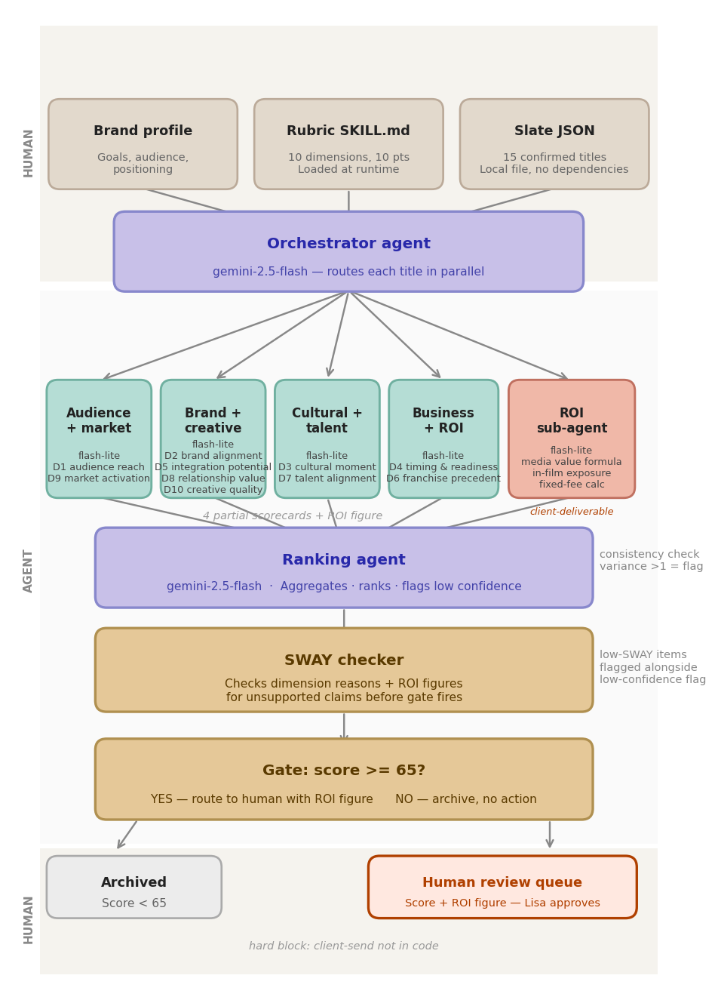

# filmIQ

**Kaggle Agents for Business Capstone -- Google ADK 2.2.0**

Seven specialized AI agents score a full film studio slate for brand partnership fit with ROI in minutes, routing only the strongest titles to a human decision-maker.

---

## The Problem

A brand's entertainment marketing team evaluates film partnerships one title at a time. Each evaluation is a multi-step workflow: pull audience comps, run the ROI formula, layer in cultural signals, and score fit across ten dimensions. A team can deeply evaluate a handful of films per cycle. Most of the slate never gets a real look. The best fit goes unseen -- not because it was rejected, but because there were not enough hours to reach it.

The second problem is consistency. A human scorer rates the same film differently on different days, from bias, lack of IP knowledge, and fatigue. A rubric applied by an agent scores it the same way every time. That consistency makes the final shortlist trustworthy and defensible to a brand.

The third problem is structural, and it is where revenue is at risk. Film promotional partnerships are allocated by brand category: once a studio approves a fast food brand for a film, every other fast food brand is locked out for that film's entire marketing cycle. The slot cannot be recovered. The approval pipeline compounds this: studio, producer, talent, and director must all sign off, which takes weeks even after a brand submits a compelling offer. A team evaluating films one at a time finishes its review after the slot is gone. The revenue that partnership would have delivered goes with it.

Speed is not a feature. It is a structural requirement. The brand that identifies the best-fit film fastest, submits the most grounded offer first, and clears the approval pipeline before competitors finish their first evaluation wins the category slot -- and the revenue that comes with it.

---

## The Solution

filmIQ is a multi-agent system built on Google ADK 2.2.0. It scores a film slate against a 10-dimension brand fit rubric, grounds each score in a documented ROI calculation, ranks the full slate, and routes films scoring 65 or above to a human review queue. Films below 65 are archived with full scored documentation.

The system runs in minutes. The team reviews what scores and submits before the category fills.

filmIQ was built and validated on a curated 15-film slate drawn from an initial pool of 70 films open for promotional partnerships. The orchestrator loop iterates over the slate by title -- adding titles increases run time, not architectural complexity. The same system scores 50-100+ films per cycle without modification.

---

## Architecture



The system follows a human-led three-zone structure.

**Zone 1 -- Human (Start).** The brand defines the rubric (SKILL.md), curates the slate (data/slate.json), and sets the gate threshold. These are judgment decisions the system inherits and does not override.

**Zone 2 -- Agent (Middle).** Five parallel agents score each film against the rubric. A ranking agent aggregates scores, runs a self-correction loop, and applies the 65-point gate. A SWAY checker audits each scorecard for internal inconsistency before any film routes forward.

**Zone 3 -- Human (End).** The gate output is a human review queue. The brand reviews each routed film, weighs the intangibles the rubric cannot capture -- talent controversies, director flexibility with brand partners, cultural timing -- and makes the partnership decision.

### Agent Map

| Agent | Model | Dimensions |
|---|---|---|
| audience_market_agent | gemini-2.5-flash-lite | D1 (Audience Fit), D9 (Market Activation) |
| brand_creative_agent | gemini-2.5-flash-lite | D2, D5, D8, D10 |
| cultural_talent_agent | gemini-2.5-flash-lite | D3, D7 |
| business_roi_agent | gemini-2.5-flash-lite | D4, D6 (Franchise Activation Precedent) |
| roi_subagent | gemini-2.5-flash-lite | Deterministic media value calculation |
| ranking_agent | gemini-2.5-flash | Score aggregation, self-correction loop, gate |
| sway_checker | gemini-2.5-flash | Scorecard consistency audit |

**ROI subagent -- deterministic by design.** Every other agent in the system reasons and infers. The ROI subagent does not. It runs a fixed media value formula against documented inputs -- channel type, viewership, spot length, placement quantity, and a four-tier quality multiplier -- and returns a dollar figure. The formula and CPM rates are proprietary and are not published in this repository; the config file references them as internal methodology. The output is a calculation, not an inference, which means it carries no hallucination risk. This is architecturally intentional: the one number a brand will present to a CFO is produced by the one agent that cannot guess.

The ROI subagent runs in parallel to the scoring chain, not as part of it. Dimension 6 (Franchise Activation Precedent) scores data confidence -- how trustworthy are the comps. The ROI subagent produces the actual dollar figure. They are independent outputs that the ranking agent reconciles at aggregation. The score and the dollar figure answer different questions and are produced by separate mechanisms.

### Scoring Rubric -- 10 Dimensions, 100-Point Total

| Dimension | What It Measures |
|---|---|
| D1 -- Audience Fit | Overlap between the film's target audience and the brand's core consumer base |
| D2 -- Brand Alignment | Fit between the film's tone, narrative, and values and the brand's identity |
| D3 -- Cultural Moment | Whether the film lands in a cultural conversation the brand wants to be part of |
| D4 -- Timing and Readiness | Compatibility between the film's release window and the brand's planning cycles |
| D5 -- Integration Potential | How naturally the brand can be embedded in the film's promotional ecosystem |
| D6 -- Franchise Activation Precedent | Whether the IP has a documented history of successful brand co-promotion |
| D7 -- Talent Alignment | Whether the film's cast and director align with the brand's values and risk tolerance |
| D8 -- Relationship Value | Whether the partnership creates long-term value beyond the single film |
| D9 -- Awareness Potential | The film's projected cultural reach, media impressions, and box office trajectory |
| D10 -- Creative Quality | The film's critical positioning and whether it will reflect well on brand partners |

Gate threshold: 65. Films at or above 65 route to human review. Films below 65 are archived with full documentation.

---

## Concept 1: Multi-Agent Orchestration (Google ADK 2.2.0)

Five agents run in parallel per film. Each agent holds context only for its assigned dimensions and scores only what it knows. The orchestrator coordinates them without any agent knowing what the others are doing.

The ranking agent aggregates outputs from all five. The SWAY checker (Shift-Weighted Agreement Yield, Bhalla & Gligorovic, Johns Hopkins, arXiv:2604.02423, 2026) runs four targeted audits per scorecard before any film reaches the human gate:

| Check | What It Audits |
|---|---|
| Routing consistency | Does the routing decision match the score? |
| Note-score alignment | Does the written rationale support the number? |
| Low-confidence consistency | Are weak-confidence dimensions reflected in the aggregate score? |
| ROI-feasibility alignment | Do ROI projections match integration feasibility? |

SWAY detects sycophancy -- the tendency of a model to shift answers toward whatever position is signaled, regardless of correctness. In a multi-agent system, five independent scorers can each be internally consistent while collectively producing a misaligned scorecard. A single-agent system cannot produce this failure mode. SWAY catches it.

Live result: T10 (The Batman: Part II) scored below threshold. SWAY fired Check 4 -- D5 (Integration Potential) scored low because integration was structurally constrained, but ROI projections were generated regardless. Without SWAY: silent archive with a contradictory scorecard. With SWAY: the contradiction is documented and the human gate inherits a clean record.

Domain partitioning prevents context-rot. A single agent mixing audience fit, ROI feasibility, and cultural talent alignment dilutes reasoning across all three as dimensions compete for context. Separate agents mean each domain gets its full context window. Adding a new scoring dimension means extending an agent or adding one -- not rewriting the orchestrator.

---

## Concept 2: Agent Skills (SKILL.md as Runtime-Loaded Rubric)

The scoring rubric lives in SKILL.md, not in agent code. Each scoring agent loads the rubric at runtime. The rubric defines all ten dimensions, their scoring criteria, and the logic for what earns each score range.

Separating the rubric from the code has two practical consequences. First, a business rule change is a rubric edit, not a code deployment. Second, an executive, marketing lead, or brand stakeholder can read SKILL.md and understand exactly what the system evaluates -- no code required.

The rubric is the business judgment. The agents are the execution mechanism.

---

## Concept 3: Security by Design (Hard Block + Human Gate + Zero Ambient Authority)

Three controls: structural, behavioral, and architectural.

**Hard block.** Client-send does not exist in the codebase. The system cannot send a scorecard to a brand because there is no function to call. A runtime check can be bypassed by a code change. A function that does not exist cannot be enabled by a code change. The constraint is architectural.

**Human gate.** No film routes to human review without a score at or above 65. No film at or above 65 is archived. The gate fires deterministically on the numeric score. These are invariants the eval harness tests on every run.

**Zero Ambient Authority.** Each agent holds only the access its assigned task requires. No cluster agent can invoke another. No agent can call client-send. The constraint boundary is encoded in what each agent is given -- not in what it is told to avoid.

Security by design is not a policy statement. It is a tested and proven property of the system.

---

## Concept 4: Deployability (Vertex AI Agent Engine)

filmIQ is deployed as a live Reasoning Engine on Google Cloud Vertex AI Agent Engine (Agent Runtime), region us-east1. The local version runs exactly as documented below. The deployed version wraps the orchestrator output as a callable endpoint using the AdkApp template.

Deployment used the agents-cli `deploy` command and the Vertex AI Agent Engine ADK template. The Reasoning Engine ID is stored in `deployment_metadata.json` (excluded from this repository -- contains live GCP resource identifiers). The live Reasoning Engine, active sessions, and deploy command output are demonstrated in the submission video and shown in the Media Gallery.

To reproduce the deployment:

```powershell
# Set environment variables
$env:GOOGLE_API_KEY="your-api-key-here"
$env:GOOGLE_GENAI_USE_VERTEXAI="true"
$env:GOOGLE_CLOUD_PROJECT="your-gcp-project-id"
$env:GOOGLE_CLOUD_LOCATION="us-east1"

# Deploy
agents-cli deploy
```

Requires a Google Cloud project with Vertex AI API enabled and billing active.

---

## Concept 5: Antigravity (Review-Driven Development)

filmIQ was built entirely in Antigravity IDE v1.23.2 using Review-Driven Development mode. Every agent, orchestrator function, and eval harness was produced through plan-then-execute cycles: the agent produced a reviewable implementation plan before writing any code, and each plan was steered before execution.

This is the human-led sandwich applied at the IDE level. The build process mirrors the system's own architecture: human judgment at the start and end, agent execution in the middle.

---

## Eval Harness

`eval_harness.py` is a separate test script. It does not re-score films or call any APIs. It reads the output of a completed slate run from `outputs/scores.json` and tests six conditions:

| Test | Condition Tested |
|---|---|
| FC1 | 503 crash terminates run before all 15 films complete |
| FC2 | Gate fires on a film whose score is below 65 |
| FC3 | A film at or above 65 is archived |
| FC4 | SWAY flag fires on more than 3 films in a single run (signals systemic drift) |
| GI1 | All routed films carry scores at or above 65 |
| GI2 | All film records carry a run timestamp |

Two consecutive validation runs returned PASS on all six tests.

Run timestamps in every film record are auditable. If a film's score changes between runs after a casting announcement or a real-world event, the diff is traceable. The timestamp is how the system earns trust over time.

---

## What to Look at in the Code

All agent files contain inline comments explaining implementation decisions, design patterns, and behavioral constraints. Three files demonstrate the core design decisions:

- `sway_checker.py` -- four-check audit logic that catches cross-agent contradictions before the gate fires
- `eval_harness.py` -- six deterministic tests that run against cached JSON with zero API calls, proving security invariants without re-scoring
- `SKILL.md` -- runtime-loaded rubric that separates business rules from agent code; change the rubric without touching the agents

Two files demonstrate the architecture:

- `orchestrator.py` -- coordinates five parallel agents per film, aggregates outputs, applies the gate; the multi-agent loop is here
- `agents/ranking_agent.py` -- self-correction loop and gate logic; the deterministic routing decision that the eval harness tests

---

## Project Structure

```
filmiq/
├── orchestrator.py              # Main entry point -- runs full slate
├── eval_harness.py              # Test harness -- six tests, PASS/FAIL/WARN
├── SKILL.md                     # 10-dimension scoring rubric (Concept 2)
├── config.ini                   # Model assignments, thresholds, CPM config
├── app.py                       # ADK app entry point
├── arch_fixed.png               # Architecture diagram
├── filmIQ_CoverImage.png        # Kaggle submission cover image
├── agents/
│   ├── audience_market_agent.py
│   ├── brand_creative_agent.py
│   ├── cultural_talent_agent.py
│   ├── business_roi_agent.py
│   ├── roi_subagent.py
│   ├── ranking_agent.py
│   └── sway_checker.py
├── app/                         # Agent Runtime deployment wrapper
├── data/
│   ├── slate.json               # 15-title film slate
│   └── brand_profile.json       # Brand profile (GenericCPG)
├── outputs/
│   ├── scores.json              # Cached slate run output
│   ├── consistency_report.json
│   └── eval_report.json
├── skills/
│   └── film-partnership-scoring-rubric.md  # Source rubric (SKILL.md copy)
└── tests/
    ├── eval/
    ├── integration/
    └── unit/
```

---

## Setup

### Prerequisites

- Python 3.11 or higher
- uv package manager: https://docs.astral.sh/uv/getting-started/installation/
- Google AI API key with Gemini 2.5 Flash access

### Install

```bash
git clone https://github.com/vulisavan/filmiq
cd filmiq
uv sync
```

### Environment Variables

Set these at the start of each terminal session. Do not commit your API key.

**Windows PowerShell:**
```powershell
$env:GOOGLE_API_KEY="your-api-key-here"
$env:GOOGLE_GENAI_USE_VERTEXAI="false"
```

**macOS / Linux:**
```bash
export GOOGLE_API_KEY="your-api-key-here"
export GOOGLE_GENAI_USE_VERTEXAI="false"
```

### Run the Full Slate

```bash
uv run python orchestrator.py
```

Outputs are written to `outputs/scores.json` and `outputs/consistency_report.json`.

**Timing note:** Google API 503 errors have been observed before approximately 2:30 PM PT. Schedule full runs after that window.

### Run the Eval Harness

```bash
uv run python eval_harness.py
```

Reads from `outputs/scores.json`. No API calls. Returns PASS, FAIL, or WARN with a per-test breakdown.

---

## Submission Notes

- **Track:** Agents for Business
- **Concepts demonstrated:** Multi-Agent Orchestration (Concept 1), Agent Skills via SKILL.md (Concept 2), Security by Design (Concept 3), Deployability on Vertex AI Agent Engine (Concept 4), Antigravity Review-Driven Development (Concept 5)
- **Security patterns:** Hard block (structural), Human gate (behavioral), Zero Ambient Authority (scoped permissions)
- **Eval harness:** PASS on all six tests across two consecutive runs
- **API keys:** Environment variables only, never committed to this repository
- **Framework:** Google ADK 2.2.0
- **Models:** gemini-2.5-flash (ranking_agent, sway_checker), gemini-2.5-flash-lite (all cluster agents and roi_subagent)
- **Media Gallery:** arch_fixed.png (architecture diagram), filmIQ_CoverImage.png (cover), Antigravity_IDE_eval_harness_screenshot.png (eval harness PASS + code comments), Antigravity_IDE_Screenshot_Concept5.png (deploy command in Antigravity terminal), Google_Cloud_Agent_Platform_Deployment_Image.png (live sessions on Agent Platform)

---

## License

This project is licensed under the MIT License — see the [LICENSE](LICENSE) file for details.

This project includes Google ADK template files under the Apache License 2.0, located in `app/` and `tests/`. All other code is original to this project and covered under the MIT License above.
